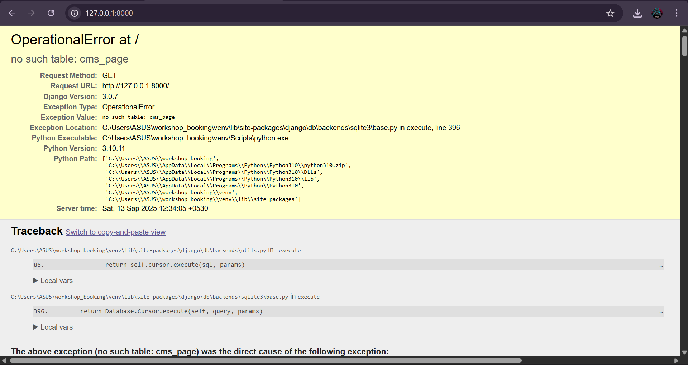
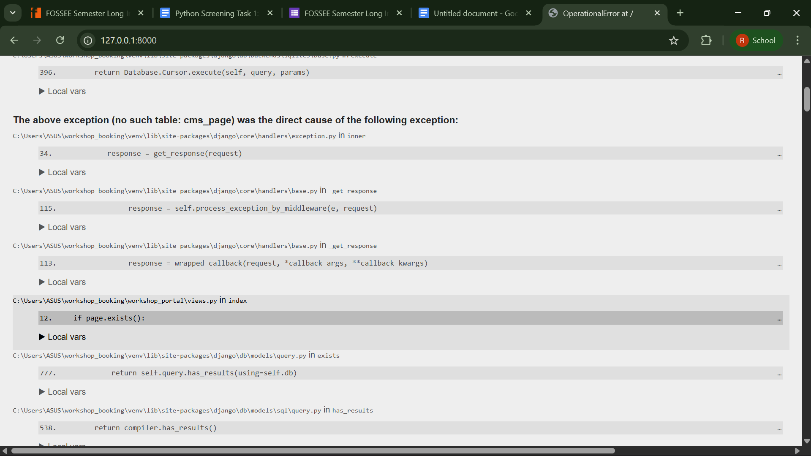
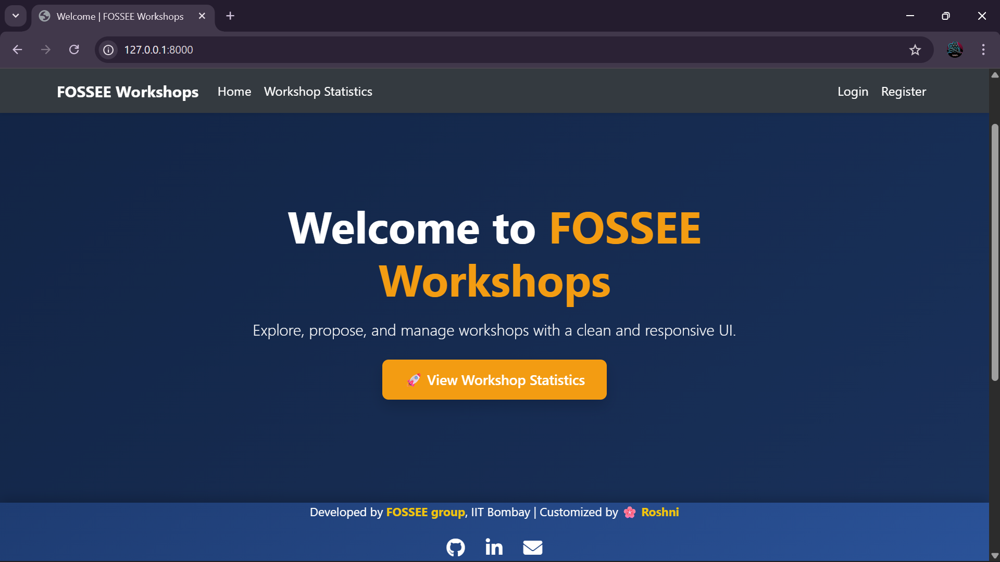
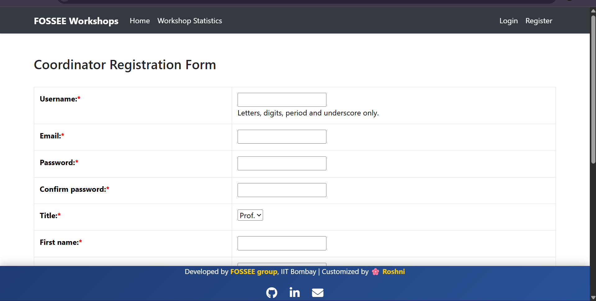
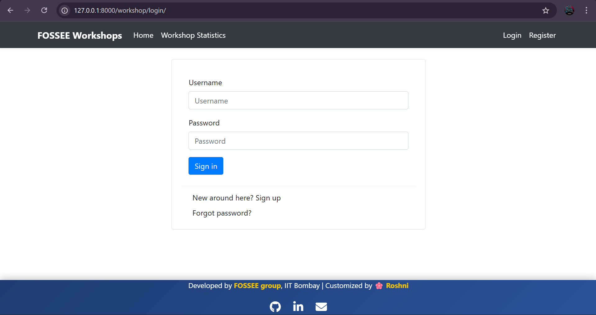
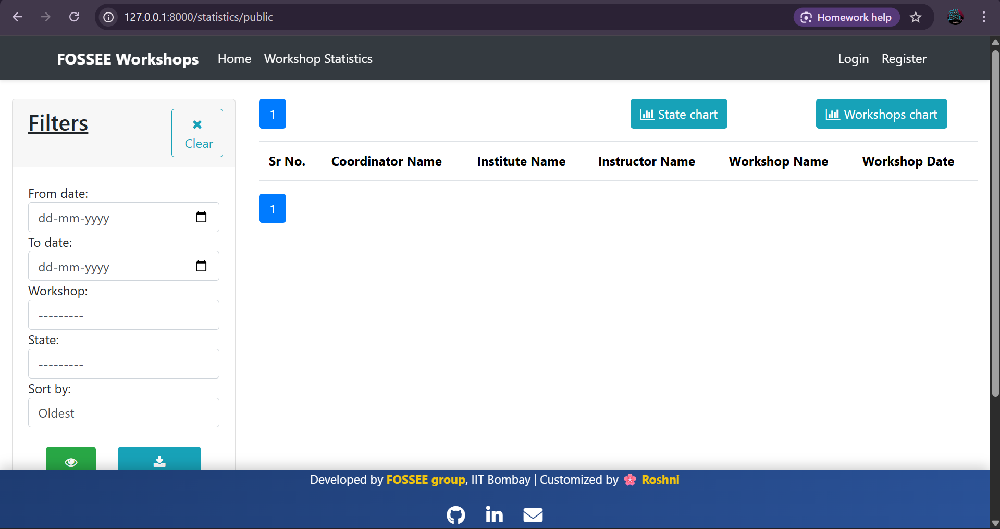
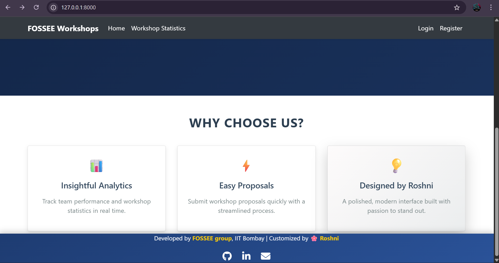

# FOSSEE Internship – Python Screening Task 1  
**UI/UX Enhancement for Workshop Booking Portal by Roshni Sharma**  

This project is my submission for the FOSSEE Internship Screening Task 1.  
I worked on improving the **UI/UX** of the given Django-based Workshop Booking Portal by redesigning the base layout, navigation, and landing page for a more modern and responsive experience.  

---

## 🚀 Features & Enhancements
- **Modern Hero Section** with welcoming message and CTA button.  
- **Polished Navbar** with improved readability and responsive design.  
- **Custom Gradient Backgrounds** for a fresh, professional look.  
- **Feature Cards** section to highlight workshop benefits.  
- **Customized Footer** with social icons (GitHub, LinkedIn, Email).  
- **Mobile-Friendly Layout** for students accessing on phones.  

---

## My Reasoning Behind Improvements in the UI/UX Of the Website

### 1. **What design principles guided your improvements?**
- **Clarity & Simplicity** → Removed clutter, focused on key actions (View Statistics, Propose Workshop).  
- **Visual Hierarchy** → Used larger headings, highlight colors, and spacing for better flow.  
- **Consistency** → Bootstrap + custom styles to ensure a professional, unified look.  
- **Accessibility** → Clear contrast, readable fonts, semantic HTML.  

### 2. **How did you ensure responsiveness across devices?**
- Used **Bootstrap 5 grid system** and utility classes (`d-flex`, `text-center`, `container`, `row`).  
- Hero section and feature cards scale properly on mobile screens.  
- Navbar collapses into a hamburger menu for small devices.  

### 3. **What trade-offs did you make between the design and performance?**
- Added **animations and gradients** for a polished feel (slightly larger CSS size).  
- But avoided heavy images → kept **fast load time**.  
- Used CDN-hosted libraries (Bootstrap, Animate.css) instead of downloading to reduce project size.  

### 4. **What was the most challenging part and how did you approach it?**
- The original site had **CMS dependency**, causing errors.  
- I bypassed CMS checks and created a **custom landing page (index.html)**.  
- Then polished base.html to apply global changes.  
- Debugging Django template/static paths was difficult at first, but solved by testing step by step.    

---

## 📸 Visual Showcase
### Before:



### After:






---

## 📬 Contact  

You can reach me here:  

- [](https://www.linkedin.com/in/roshni-sharma-767544251/)  
- [](mailto:roshnis1127@gmail.com)  
- [](https://github.com/roshnisharma2811)  

## Setup Instructions
```bash
# Clone repository
git clone [https://github.com/roshnisharma2811/FOSSEE-Internship-Project.git]
cd FOSSEE-Internship-Project

# Create virtual environment
python -m venv venv
venv\Scripts\activate    # on Windows

# Install dependencies
pip install -r requirements.txt

#Apply Migrations
python manage.py migrate

# Run Django server
python manage.py runserver

#Open in Browser
http://127.0.0.1:8000/
